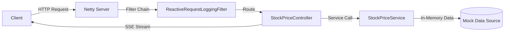

# Architecture & Design

## Technology Stack
- **Java 17:** Utilizes modern features like `record` for immutable data carriers and `Pattern Matching` for cleaner code.
- **Spring Boot 3 (WebFlux):** The reactive web framework that replaces the traditional Servlet API with a non-blocking event-loop model.
- **Netty:** The default high-performance, non-blocking server used by WebFlux (instead of Tomcat).
- **Project Reactor:** The fundamental reactive library providing the `Mono` and `Flux` types used throughout the application.
- **Docker & Docker Compose:** Simplifies deployment and ensures environment consistency.

## High-Level Design (HLD)

1. **Client Interaction:** Clients interact via standard REST endpoints or SSE streams.
2. **WebFilter Middleware:** Every request passes through `ReactiveRequestLoggingFilter`, which logs the request method, path, and duration asynchronously.
3. **Reactive Pipeline:** Data flows through the system as `Mono` (0-1 item) or `Flux` (0-N items), ensuring no blocking calls occur anywhere in the request-response chain.

## Low-Level Design (LLD)
### Separation of Concerns
- **Models (`models/`):** Uses Java `record` to ensure immutability. This is critical in concurrent environments to prevent side effects.
- **Services (`service/`):** Contains the business logic and manages the in-memory data store. Uses reactive operators like `flatMap` and `Flux.interval` to process data.
- **Controllers (`controller/`):** Purely responsible for HTTP routing and mapping service outputs to appropriate HTTP responses/media types.
- **Filters (`filter/`):** Cross-cutting concerns like logging are handled here using `WebFilter`.

### Key Reactive Concepts Applied
- **Non-blocking Delays:** Instead of `Thread.sleep()`, we use `Flux.interval()` for the stock price stream.
- **Asynchronous Logging:** The logging filter uses `.doFinally()` to ensure logs are written only after the response is completed, without blocking the main execution path.
- **Pure Reactive Chains:** All endpoints are designed to return `Mono` or `Flux` directly, avoiding any `.block()` calls.
